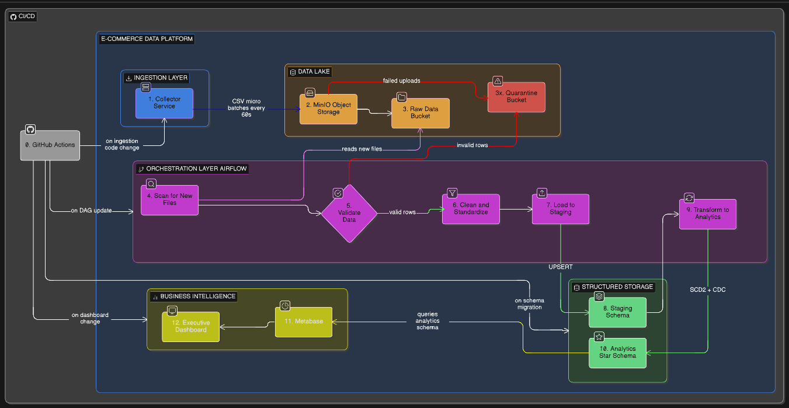
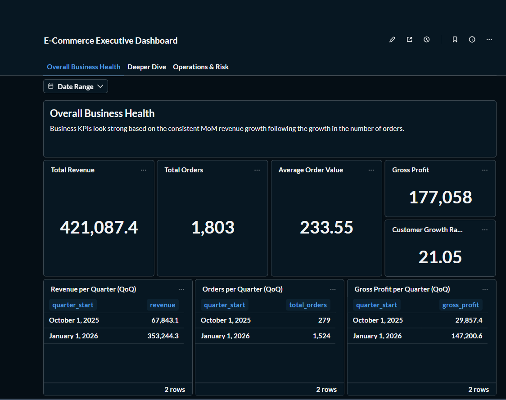
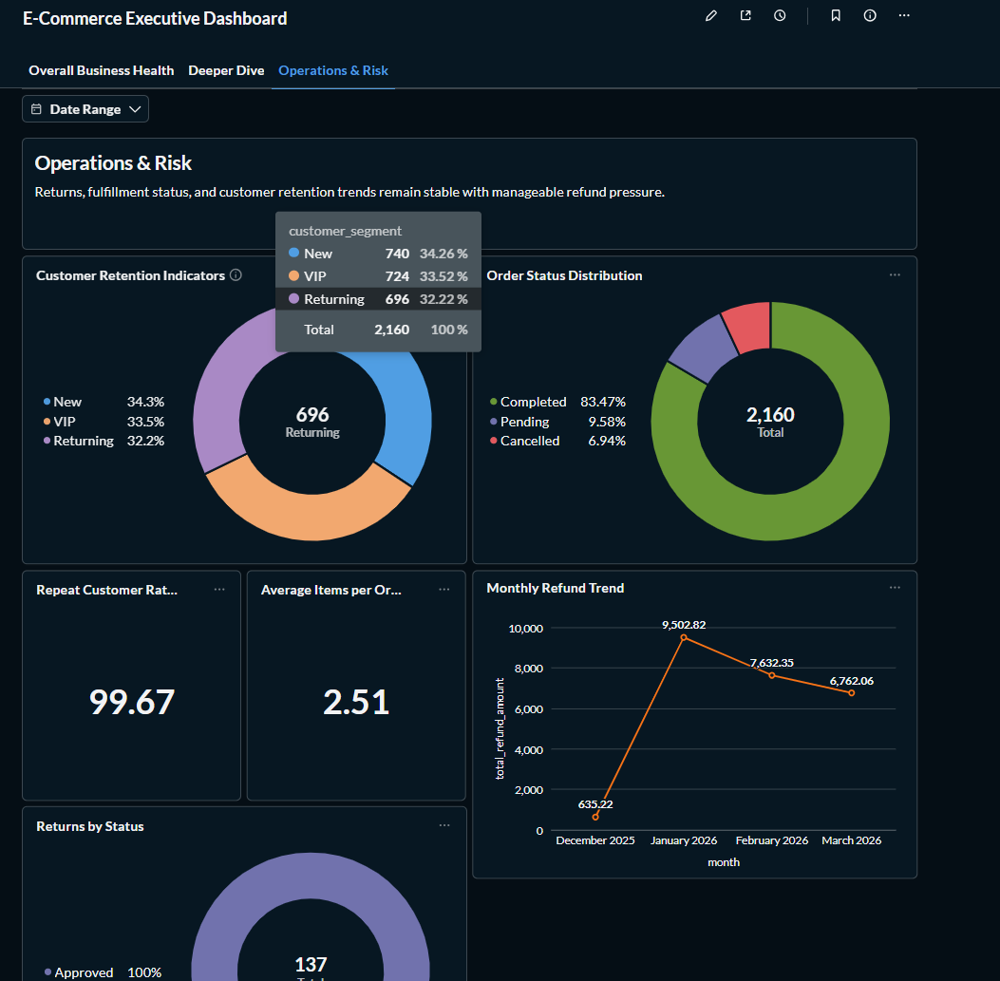
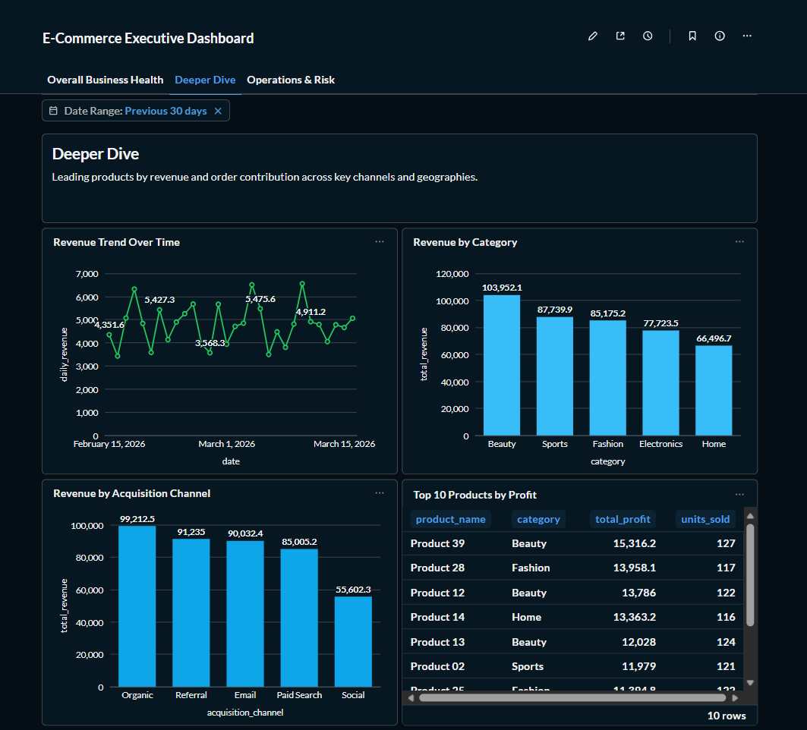
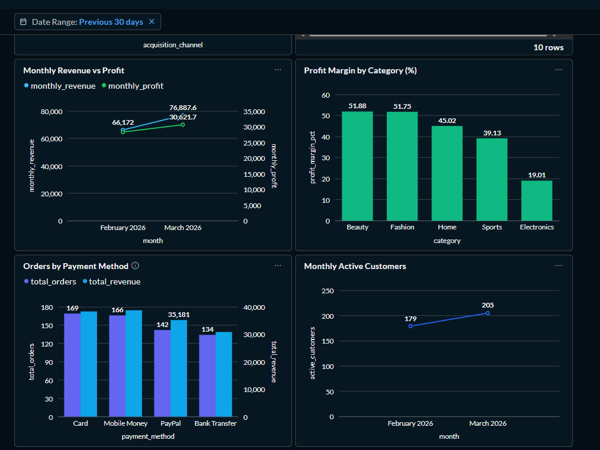
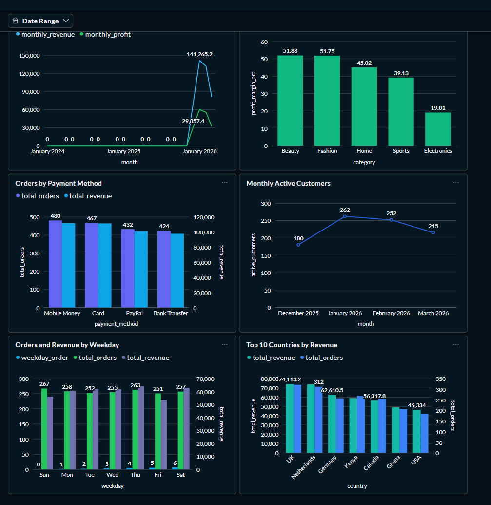

# Mini Data Platform

## E-Commerce Sales & Operations Analytics System

A fully containerised, end-to-end data engineering platform that simulates a real-world e-commerce analytics environment. The system ingests transactional data, processes and models it through a star schema, and surfaces executive KPIs via interactive dashboards — all running locally with a single command.

---

## Architecture

[]()

---

## Services

| Service | Technology | Port(s) | Description |
|---|---|---|---|
| `collector` | Python 3.11 | — | Generates 7 entity batches every 60s, uploads to MinIO |
| `minio` | MinIO | 9000, 9001 | S3-compatible object storage (data lake) |
| `minio-init` | MinIO mc | — | Creates `raw-data` and `quarantine` buckets on first start |
| `postgres` | PostgreSQL 16 | 5432 | Relational analytics store with star schema |
| `airflow-init` | Airflow 2.9.3 | — | Migrates the Airflow DB and creates the admin user |
| `airflow-webserver` | Airflow 2.9.3 | 8080 | Airflow UI for monitoring DAGs |
| `airflow-scheduler` | Airflow 2.9.3 | — | Schedules and triggers DAG runs |
| `metabase` | Metabase | 3000 | Business intelligence dashboards |

---

## Quick Start

### Prerequisites

- [Docker](https://docs.docker.com/get-docker/) v20+
- [Docker Compose](https://docs.docker.com/compose/) v2+
- [GNU Make](https://www.gnu.org/software/make/) (optional, for Makefile shortcuts)

### 1. Clone and configure

```bash
git clone <your-repo-url>
cd dem12-mini-lab
cp .env.example .env
# Open .env and update credentials as needed
```

### 2. Start the stack

```bash
# Using Make (recommended)
make up

# Or directly
docker compose up -d --build
```

### 3. Access the services

| Service | URL | Credentials |
|---|---|---|
| Airflow UI | http://localhost:8080 | `admin` / value from `AIRFLOW_ADMIN_PASSWORD` in `.env` |
| MinIO Console | http://localhost:9001 | `MINIO_ROOT_USER` / `MINIO_ROOT_PASSWORD` from `.env` |
| Metabase | http://localhost:3000 | First-launch setup wizard |
| PostgreSQL | `localhost:5432` | Credentials from `.env` |

### 4. Provision the Metabase dashboard

After completing the Metabase first-launch setup, add your admin credentials to `.env`:

```bash
METABASE_ADMIN_EMAIL=your@email.com
METABASE_ADMIN_PASSWORD=yourpassword
```

Then run:

```bash
make dashboard-metabase
```

This will automatically connect Metabase to PostgreSQL and provision 11 question cards and the executive dashboard.

### Dashboard Preview

| Executive Overview | Operations & Risk |
|---|---|
|  |  |

| Deep Dive 1 | Deep Dive 2 |
|---|---|
|  |  |

| Deep Dive 3 |
|---|
|  |

---

## Makefile Commands

```bash
make setup          # First-time setup: copy .env, build, and start
make up             # Start the full stack (detached)
make down           # Stop all containers
make restart        # Restart all containers
make build          # Rebuild Docker images
make ps             # Show container status
make logs           # Tail all service logs
make logs-airflow   # Tail Airflow webserver logs only
make logs-collector # Tail Collector logs only

make psql           # Open a psql shell into the ecommerce database
make show-tables    # List all staging and analytics tables
make row-counts     # Print row counts for key analytics tables

make trigger        # Manually trigger the ecommerce_pipeline DAG
make dag-list       # List all registered Airflow DAGs

make dashboard-metabase  # Provision Metabase dashboards via the REST API

make test           # Run the full pytest unit test suite

make clean          # Stop containers and remove images
make nuke           # Full teardown including all data volumes (destructive)
```

---

## Data Flow

### 1. Ingestion (Collector)

The Collector service generates realistic micro-batches of transactional data every 60 seconds for seven entities:

| Entity | Description |
|---|---|
| `customers` | User profiles — country, acquisition channel, segment |
| `products` | Product catalog — category, cost and selling price |
| `orders` | Purchase transactions — FK to customer and product |
| `payments` | Payment records — FK to orders |
| `inventory` | Warehouse stock levels |
| `revenue` | Daily aggregated revenue snapshots |
| `returns` | Customer refunds — FK to orders |

Each batch is uploaded to MinIO as time-partitioned CSV files:

```
raw-data/
  customers/2024/03/01/customers_20240301_120000.csv
  orders/2024/03/01/orders_20240301_120000.csv
  ...
```

### 2. Processing (Airflow)

The `ecommerce_pipeline` DAG runs hourly. For each entity it:

1. **Scans** MinIO for files not yet recorded in `staging.processed_files` (idempotency gate)
2. **Validates** each file — checks for nulls, UUID format, enum allowlists, negative numerics, and duplicates
3. **Quarantines** any invalid rows to the MinIO `quarantine/` bucket (Dead Letter Queue)
4. **Cleans** valid rows — strips whitespace, coerces types, standardises enums
5. **UPSERTs** rows into the staging schema using `INSERT ... ON CONFLICT DO UPDATE`
6. **Marks** the file as processed in `staging.processed_files`

After all entities are staged, `transform_to_analytics` runs:

| Table | Strategy |
|---|---|
| `dim_customers` | SCD Type 2 — expires the current row and inserts a new version when attributes change |
| `dim_products` | SCD Type 2 — same pattern as dim_customers |
| `dim_inventory` | Snapshot UPSERT — always reflects the latest state |
| `fact_orders` | CDC-aware UPSERT — updates `order_status` for late-arriving state changes |
| `fact_payments` | Standard UPSERT |
| `fact_returns` | Standard UPSERT |
| `agg_revenue` | DELETE-then-INSERT — rebuilds daily totals idempotently |

### 3. Analytics (PostgreSQL Star Schema)

```
analytics.dim_date       -- 2024–2026 pre-populated
analytics.dim_customers  -- SCD2: valid_from, valid_to, is_current
analytics.dim_products   -- SCD2: valid_from, valid_to, is_current
analytics.dim_inventory  -- current snapshot
analytics.fact_orders    -- partitioned monthly by order_timestamp
analytics.fact_payments
analytics.fact_returns
analytics.agg_revenue    -- daily totals
```

### 4. Dashboards (Metabase)

Seven pre-built SQL views back the dashboard cards:

| View | Dashboard Card |
|---|---|
| `v_kpi_summary` | Total Revenue, Total Orders, AOV, Gross Profit, Customer Growth Rate |
| `v_revenue_trend_daily` | Revenue Trend Over Time |
| `v_revenue_by_category` | Revenue by Category |
| `v_revenue_by_channel` | Revenue by Acquisition Channel |
| `v_top_products_profit` | Top 10 Products by Profit |
| `v_customer_retention` | Customer Retention Indicators |
| `v_order_status_distribution` | Order Status Distribution |

---

## Development & Testing

### Run the test suite

```bash
# Install dev dependencies
pip install -r requirements-dev.txt

# Run validators and cleaners unit tests (40 tests)
make test

# Or directly
pytest tests/test_validators.py tests/test_cleaners.py -v
```

### Project structure

```
.
├── .github/workflows/ci.yml       # GitHub Actions: test → build → validate
├── airflow/
│   ├── Dockerfile
│   ├── requirements.txt
│   └── dags/
│       ├── ecommerce_pipeline.py  # Main ETL DAG (hourly)
│       ├── platform_health_check.py
│       └── utils/
│           ├── validators.py      # Per-entity validation
│           ├── cleaners.py        # Type coercion and standardisation
│           ├── loaders.py         # Staging UPSERT
│           ├── transformers.py    # SCD2 / CDC / analytics transforms
│           ├── minio_helper.py    # MinIO scan, read, DLQ
│           └── db_helper.py       # PostgreSQL connections + idempotency
├── collector/
│   ├── Dockerfile
│   ├── main.py                    # Batch orchestrator
│   ├── uploader.py                # Time-partitioned MinIO upload
│   └── generators/                # One module per entity
├── metabase/
│   └── dashboard.py               # Dashboard provisioning via Metabase API
├── postgres/
│   └── init/
│       ├── 01_init.sql            # Roles, schemas, extensions
│       ├── 02_staging_schema.sql  # Staging tables
│       ├── 03_analytics_schema.sql# Star schema + partitions + dim_date
│       └── 04_analytics_views.sql # Dashboard views
├── tests/
│   ├── conftest.py                # Shared pytest fixtures
│   ├── test_validators.py
│   ├── test_cleaners.py
│   └── test_dag_integrity.py
├── .env.example                   # Credential template
├── docker-compose.yml
├── Makefile
└── requirements-dev.txt
```

---

## CI/CD

GitHub Actions runs three jobs on every push and pull request:

1. **test** — installs Python dependencies and runs the pytest unit suite
2. **build** — builds all Docker images with `docker compose build`
3. **validate** — starts the full stack, triggers the pipeline DAG, and asserts that `analytics.fact_orders` has rows greater than zero

---

## Environment Variables

Copy `.env.example` to `.env` and adjust the values:

| Variable | Description |
|---|---|
| `POSTGRES_*` | PostgreSQL database credentials |
| `MINIO_ROOT_USER / PASSWORD` | MinIO admin credentials |
| `MINIO_RAW_BUCKET` | Name of the raw data bucket (default: `raw-data`) |
| `AIRFLOW_ADMIN_USERNAME / PASSWORD` | Airflow UI login |
| `AIRFLOW__CORE__FERNET_KEY` | Airflow encryption key |
| `MB_DB_*` | Metabase PostgreSQL backend credentials |
| `COLLECTOR_BATCH_SIZE` | Records per micro-batch (default: `50`) |
| `COLLECTOR_BATCH_INTERVAL_SECONDS` | Interval between batches (default: `60`) |

---

## Non-Functional Design Decisions

| Concern | Approach |
|---|---|
| Idempotency | All staging loads use `ON CONFLICT DO UPDATE`; processed files tracked in `staging.processed_files` |
| SCD Type 2 | `dim_customers` and `dim_products` expire old rows and insert new versions on attribute change |
| CDC | Late-arriving `order_status` changes are applied via the orders UPSERT |
| DLQ | Invalid rows are written to the MinIO `quarantine/` bucket rather than silently dropped or failing the batch |
| Partitioning | `fact_orders` is range-partitioned monthly with a default catch-all partition |
| Secrets | All credentials are externalized to `.env` (never committed) |
| Health checks | Every Docker service defines a health check with appropriate start-period and retry settings |
